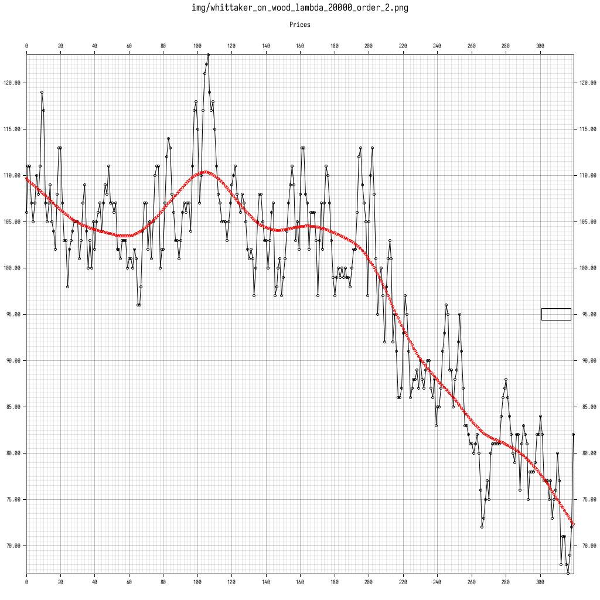
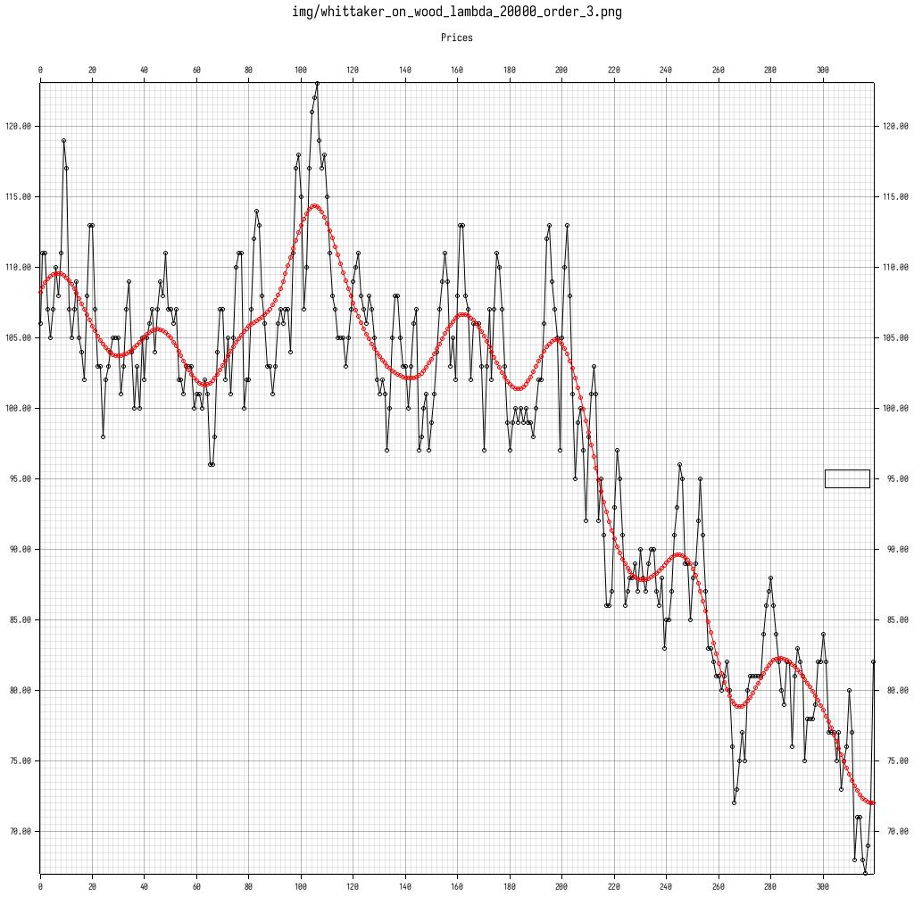

# Whittaker Smoother
Aka Whittaker-Henderson, Whittaker-Eilers Smoother is known as the perfect smoother.
Its a discrete-time version of spline smoothing for equally spaced data.
It minimizes the functional

$$\sum_{i=0}^n (z_i - y_i)^2 + \lambda \sum_{i=0}^n (\delta ^p z)_i ^2  $$

where y are the datapoints, z is the smoothed function, and $\delta^2
z$ is the pth derivative of $z_i$, which is evaluated numerically.
A penalty is imposed on nonsmooth functions, with higher values of $\lambda$ increasing the penalty and leading to a smoother output.

The smoothed output can be obtained by solving the linear system
$$x = (W + \lambda * D^T D )^{-1} W y $$
Where W is the weight matrix (Identity matrix in practice) and D is the difference matrix 
(See [`difference_matrix`](src/whittaker_smoother.rs) for its construction).

### Examples
Here we see the wood dataset smoothed whith both order 2 and 3.



### Comparison to Moving Averages and Convolution Kernels
Compared to a moving average smoother, this method does not suffer from a group-delay.

Compared to a convolution kernel such as the savitzky-golay filter, 
the values at the edge are well defined and don't need to be interpolated. 
The savitzky-golay filter does have a nice flat passband,
but suffers from unsatisfactory high-frequency noise, which is not sufficiently suppressed. 
This is a particular problem when the derivative of the data is of importance.

### Usage
To use this smoother in you project, add this to your `Cargo.toml`:
```toml
[dependencies]
whittaker_smoother = "0.1"
```

### Further Reading:
See the [papers](./papers/) folder for two papers showing additional details of the method.

This implementation was inspired by [A python implementation](https://github.com/mhvwerts/whittaker-eilers-smoother).

### License
Copyright (C) 2020  <Mathis Wellmann wellmannmathis@gmail.com>

This program is free software: you can redistribute it and/or modify
it under the terms of the GNU Affero General Public License as published by
the Free Software Foundation, either version 3 of the License, or
(at your option) any later version.

This program is distributed in the hope that it will be useful,
but WITHOUT ANY WARRANTY; without even the implied warranty of
MERCHANTABILITY or FITNESS FOR A PARTICULAR PURPOSE.  See the
GNU Affero General Public License for more details.

You should have received a copy of the GNU Affero General Public License
along with this program.  If not, see <https://www.gnu.org/licenses/>.


